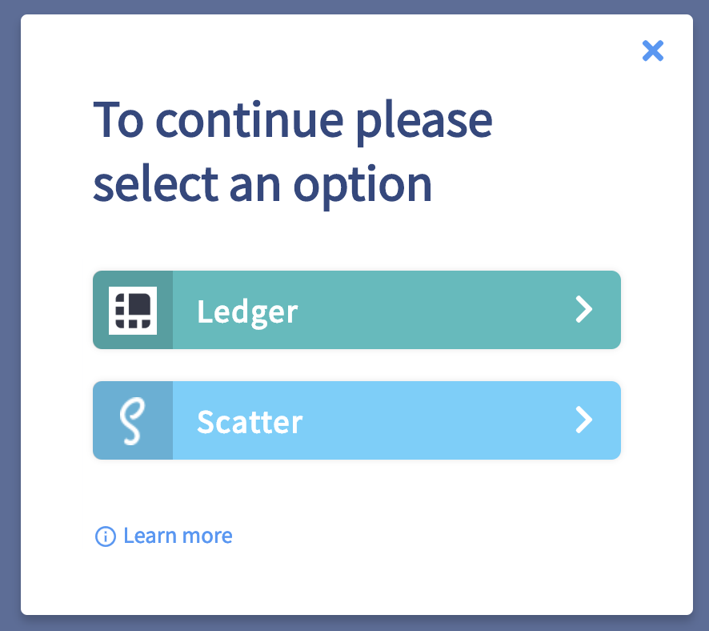
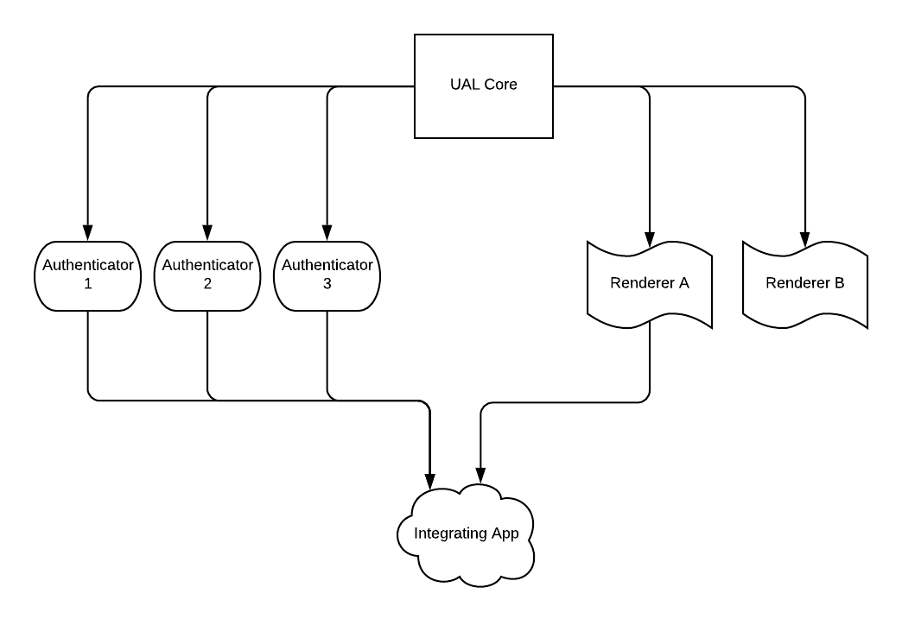

# Universal Authenticator Library (UAL Core for short)

# About EOSIO Labs

EOSIO Labs repositories are experimental.  Developers in the community are encouraged to use EOSIO Labs repositories as the basis for code and concepts to incorporate into their applications. Community members are also welcome to contribute and further develop these repositories. Since these repositories are not supported by Block.one, we may not provide responses to issue reports, pull requests, updates to functionality, or other requests from the community, and we encourage the community to take responsibility for these.

## Why UAL?
App Developers need to support many authentication providers (wallets) in order to maximize user reach and permit user choice. Today, this usually means implementing and maintaining many different APIs. The purpose of this library is to simplify, for App Developers, supporting multiple authentication providers.

The Universal Authenticator Library (UAL) achieves this goal by abstracting the internal business logic of many authentication providers and exposing a single universal API.

This lets App Developers integrate once, and support all authentication providers that implement an Authenticator for UAL.

UAL also provides a renderer concept. Renderers are used so that the login experience on every site using UAL is the same. This gives End Users the benefit of a consistent and familiar interface. By utilizing the `getStyles()` method on the Authenticators, the Authenticator button will be rendered the same on any website.

### In Summary

For integrating app developers:
* a simple way to support multiple key managers, with a few lines of code
* increases an application’s market reach, by supporting multiple authenticators
* reduces time to create applications, by eliminating the need to individually support authenticators
* access to all the necessary functions to sign transactions and customize user experience

For app users:
* a way to login to integrating apps using the authenticator of choice
* a uniform, familiar login option that instills confidence while interacting with integrating apps

The following is an example for a *desktop browser*.  Mobile wallets with built-in browsers are autodetected and will not prompt the user to select them.

*All product and company names are trademarks™ or registered® trademarks of their respective holders. Use of them does not imply any affiliation with or endorsement by them.*

## Architecture
UAL Core - Provides abstract classes/interfaces to provide consistent Public APIs for integrating developers. Also provides some minor convenience functions.

Authenticators - Communicates with the signing app/device. An Authenticator provides login/logout functionality that returns a User object. The User object allows the integrating app to request a signature through the signing app/device.

Renderers - Provides a UI layer for giving users a consistent UI/UX flow, independent of the Authenticator they are using or the site they are on.

## Usage (Authenticator Developer)

A developer that wishes to add support for their authenticator to UAL must implement 2 classes. An `Authenticator` and a `User`.

The `Authenticator` class represents the Button that will (potentially) be rendered on the screen and the business logic around logging.

Logging in returns 1 or more `User` objects. A `User` object provides the ability for a Dapp developer to request the Dapp User to sign a transaction using whichever authentication provider they selected when logging in.

## Usage (Dapp Developer)

Requires one or more Authenticators to communicate with the auth provider. Currently supported Authenticators include the following. See the [UAL New Authenticator Walkthrough](https://github.com/EOSIO/ual-authenticator-walkthrough) to learn how contributors could add new Authenticators.

Authenticators initially created by block.one:
 - [UAL for Scatter](https://github.com/EOSIO/ual-scatter)
 - [UAL for Lynx](https://github.com/EOSIO/ual-lynx)
 - [UAL for Ledger](https://github.com/EOSIO/ual-ledger)
 - [UAL for Token Pocket](https://github.com/EOSIO/ual-token-pocket)
 
Authenticators contributed by wallet providers and other community members:  
 - [UAL for MEET.ONE](https://github.com/meet-one/ual-meetone)

Recommended to use one of the prebuilt Renderers rather than the library directly:
 - [UAL Renderer for PlainJS](https://github.com/EOSIO/ual-plainjs-renderer)
 - [UAL Renderer for ReactJS](https://github.com/EOSIO/ual-reactjs-renderer)

Example usage can be found at:
 - [Basic Example App for UAL with PlainJS](https://github.com/EOSIO/ual-plainjs-renderer/tree/master/examples)
 - [Basic Example App for UAL with ReactJS](https://github.com/EOSIO/ual-reactjs-renderer/tree/master/examples)

## Contributing

[Contributing Guide](./CONTRIBUTING.md)

[Code of Conduct](./CONTRIBUTING.md#conduct)

## License

[MIT](./LICENSE)

## Important

See LICENSE for copyright and license terms.  Block.one makes its contribution on a voluntary basis as a member of the EOSIO community and is not responsible for ensuring the overall performance of the software or any related applications.  We make no representation, warranty, guarantee or undertaking in respect of the software or any related documentation, whether expressed or implied, including but not limited to the warranties of merchantability, fitness for a particular purpose and noninfringement. In no event shall we be liable for any claim, damages or other liability, whether in an action of contract, tort or otherwise, arising from, out of or in connection with the software or documentation or the use or other dealings in the software or documentation. Any test results or performance figures are indicative and will not reflect performance under all conditions.  Any reference to any third party or third-party product, service or other resource is not an endorsement or recommendation by Block.one.  We are not responsible, and disclaim any and all responsibility and liability, for your use of or reliance on any of these resources. Third-party resources may be updated, changed or terminated at any time, so the information here may be out of date or inaccurate.  Any person using or offering this software in connection with providing software, goods or services to third parties shall advise such third parties of these license terms, disclaimers and exclusions of liability.  Block.one, EOSIO, EOSIO Labs, EOS, the heptahedron and associated logos are trademarks of Block.one.

Wallets and related components are complex software that require the highest levels of security.  If incorrectly built or used, they may compromise users’ private keys and digital assets. Wallet applications and related components should undergo thorough security evaluations before being used.  Only experienced developers should work with this software.
